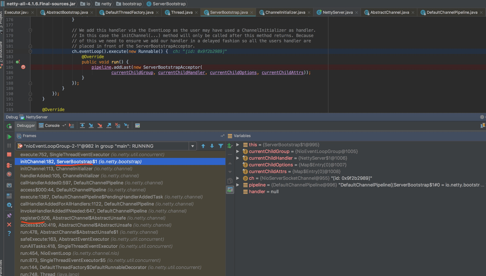

执行io.netty.channel.AbstractChannel.AbstractUnsafe#register0 的 doRegister之后，会继续执行pipeline.invokeHandlerAddedIfNeeded();


io.netty.bootstrap.ServerBootstrap#init p.addLast的io.netty.channel.ChannelInitializer#initChannel
```
 @Override
    void init(Channel channel) throws Exception {
        // 省略

        p.addLast(new ChannelInitializer<Channel>() {
            @Override
            public void initChannel(Channel ch) throws Exception {
                final ChannelPipeline pipeline = ch.pipeline();
                ChannelHandler handler = config.handler();
                if (handler != null) {
                    pipeline.addLast(handler);
                }

                // We add this handler via the EventLoop as the user may have used a ChannelInitializer as handler.
                // In this case the initChannel(...) method will only be called after this method returns. Because
                // of this we need to ensure we add our handler in a delayed fashion so all the users handler are
                // placed in front of the ServerBootstrapAcceptor.
                ch.eventLoop().execute(new Runnable() {
                    @Override
                    public void run() {
                        pipeline.addLast(new ServerBootstrapAcceptor(
                                currentChildGroup, currentChildHandler, currentChildOptions, currentChildAttrs));
                    }
                });
            }
        });
    }
 ```

 


